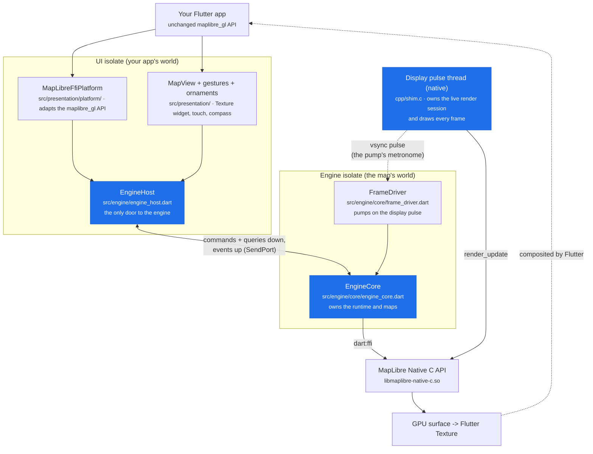
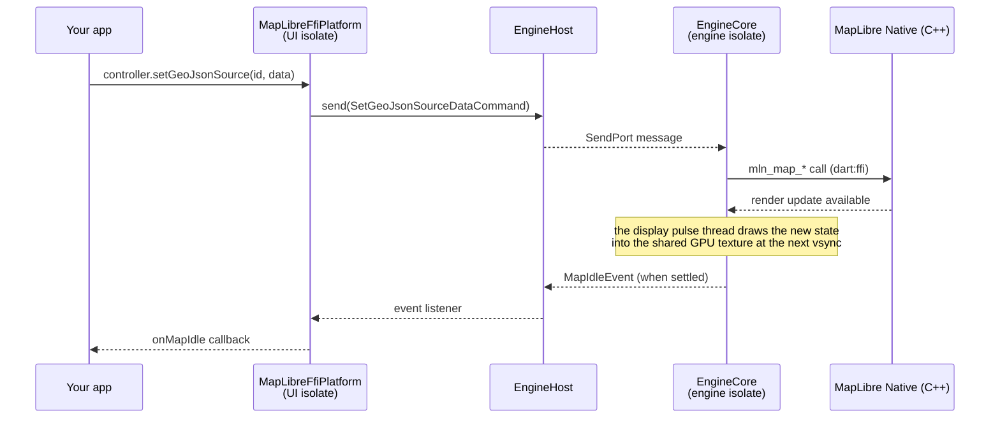
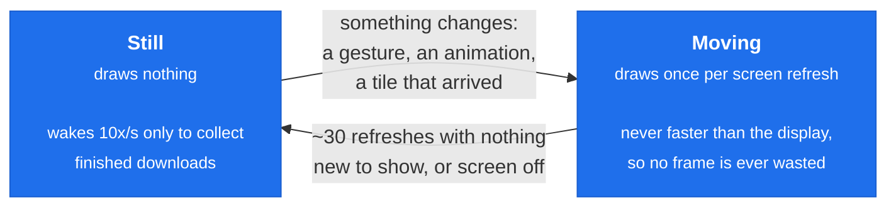

# Architecture

How the FFI engine works under the hood: what runs where, how a call travels, and where to put your hands when you want to change something. No isolate or FFI experience assumed.

## The big picture

Your app keeps using the regular `MapLibreMap` widget and `MapLibreMapController` from `maplibre_gl`: this package swaps what is behind them. Instead of a platform view driven over method channels, the map is the real MapLibre Native C++ engine, called directly from Dart through `dart:ffi`, drawing into a Flutter `Texture`.

Two ideas shape everything. First, **the engine lives on its own isolate** (think: a second Dart thread with its own memory): heavy work, like decoding map tiles and driving the style, happens there, so your UI never skips a frame because the map is busy. Second, **drawing does not happen in Dart at all**: a small native thread paced by the display owns the live render session and draws every frame itself, so not even the engine isolate's own work (an HTTP response, a garbage collection, a style parse) can delay one.



Everything that crosses between the two worlds is a plain, sendable message defined in `src/protocol/`, one file per domain. Three kinds:

- **Command**: a fire-and-forget mutation ("move the camera", "set this GeoJSON"). No reply.
- **Query**: a read with a reply ("where does this coordinate land on screen?"). Round trip ~0.1 ms.
- **Event**: the engine pushing back ("style loaded", "camera changed", "map idle").

## One call, end to end

What happens when your app calls `controller.setGeoJsonSource(...)`:



And an event flowing the other way: a pan gesture changes the camera, the engine coalesces it to one `CameraIsChangingEvent` per rendered frame, the platform adapter turns it into `onCameraMove`, and the view updates the compass and scale bar (through `ValueNotifier`s, so only the ornament repaints, never the whole map widget).

## The frame loop: when does the map draw?

A map spends most of its life sitting still, and redrawing a still map is pure waste: the new pixels would be identical to the old ones. So the map is always in one of two modes, and that is the whole idea of this part.

**Still.** Nothing is moving, so no frame is drawn at all: no GPU work, and a map left on screen costs practically nothing. Ten times a second the engine does wake up briefly, only to collect what came back from the network in the meantime (a tile finished downloading, its data has to go into the scene). If that produced something new to show, the map switches to moving on the spot, which is why a map you are not touching still finishes loading.

**Moving.** Something changed what the map should look like (your finger, a camera animation, a tile that just arrived), so the map is drawn, **exactly once per screen refresh**: 60 times a second on a 60 Hz screen, 120 on a 120 Hz one, and never more than that. The drawing itself happens on the display's own callback thread (next section); the engine isolate rides the same beat to pump the runtime, which is what feeds finished downloads and style work into the scene the next frame will draw. Once about half a second goes by with nothing new to show, or the screen turns off, it goes back to still.



In the code these two are one boolean in [`FrameDriver`](lib/src/engine/core/frame_driver.dart), which calls them *parked* and *pulsing*; the timings above are its `_idlePumpInterval`, `_idleFrameLimit` and `_pulseStaleAfter`.

### Why the screen sets the pace

A display redraws on its own fixed rhythm and, at each of those moments, takes whatever image is ready and shows it. Being late by a hair is as bad as being late by a whole refresh: the frame waits for the next one, and the eye sees a stutter.

So instead of guessing the rhythm, we listen to it. Android publishes it through a system service (`Choreographer`) that calls you back right after every refresh. A small piece of native code (`cpp/shim.c`) owns a dedicated thread subscribed to those callbacks, and on each one it does two things, in this order: it **draws the live render session itself** (`render_update`, right at the start of the refresh interval, where no Dart work can delay it), and then it forwards the timestamp to the engine isolate as a single message: that message is what this codebase calls the **vsync pulse** ("vsync" is the display's own refresh signal). The pulse no longer carries the frame; it is the metronome for the runtime pump, so tile and style work is integrated once per refresh and the next frame draws it. Rendering first and pumping after costs one frame of staleness and buys a frame path that nothing in Dart can delay.

Why not a plain Dart timer ticking at the same rate? Because the rate is not the point, the alignment is: a timer runs at its own phase, drifts against the display, and lands near the deadline as often as far from it. Measured on the benchmark device (forcing the timer path with `--dart-define=MLN_FORCE_TIMER_PACING=true`, 2026-07-23), it costs 30-36 % of the map's fps in every gesture and tracking scenario (pan 75 -> 52 fps, tracking 80 -> 52) and more than doubles UI jank. The timer stays in as a fallback: if the vsync service is unavailable (very old devices, exotic failures), the driver logs loudly and paces itself on a timer matched to the refresh rate.

## Threading rules (the part that bites)

MapLibre Native's objects are **thread-affine**: each one belongs to the thread it was created on and may only be used from that thread. Using one from elsewhere fails loudly with a wrong-thread status. That single fact is why the package is shaped the way it is: the engine isolate owns the runtime and the maps, the display pulse thread owns the live render session, and nothing else is allowed near either.

- `src/engine/` is the only layer that imports `mln.*`. Everything else can only send messages, so it cannot break the rule even by accident.
- The Dart VM may move an isolate onto a different OS thread between two callbacks, which would silently break that ownership. A check before every native call notices the thread changed and tells the native runtime to adopt the new one (`mln_runtime_rebind_thread`, one of our upstream patches). That rebind covers the runtime, its maps, and its projections, deliberately NOT render sessions, or it would steal one from the thread drawing it. A "runtime rebound" line in the log is that check doing its job, not a warning.
- The display pulse thread owns the live render session and calls `render_update` itself (upstream #399 made a session's owner the thread that attached it, so this is legal). The session calls Dart still needs (feature queries, feature state, resize, surface replace, detach) borrow it back for the length of one call under a mutex (`RenderThread.borrow`, which also re-homes the session after an isolate migration, since the runtime rebind no longer does). Renders happen 60-90 times a second and borrows are rare, so the display thread simply keeps it.

## Directory map

The tree mirrors the isolate boundary, so the answer to "where does my code go?" is always the answer to "which side of the port does it run on?".

| Directory | What lives there | Touch it when... |
|---|---|---|
| `src/api/` | the entire public surface: `MapLibreGlNative` (opt into the backend) and `MapLibreGlNativeOffline`. `lib/maplibre_gl_native.dart` is nothing but the library doc and the two exports | you add something an app calls directly (rare: the map API belongs to `maplibre_gl`) |
| `src/protocol/` | every message that crosses the port, one file per domain: `session`, `camera`, `style`, `runtime`, `queries`, `events`; `protocol.dart` holds the base types and the shapes they share | you add an engine capability (start here) |
| `src/engine/` | `EngineHost` (the door, runs on the UI isolate), `render_backend.dart` | you change how the two isolates talk |
| `src/engine/core/` | the engine isolate itself: `EngineCore` + parts, frame driver, vsync, the display-thread handover (`render_thread.dart`), HTTP provider, JSON converters | you add engine capabilities or change how frames render |
| `src/presentation/platform/` | the `MapLibrePlatform` adapter and what it delegates to: feature interaction, location, snapshots, style resolution, option decoding | you wire an existing engine capability to the public API |
| `src/presentation/map/` | `MapView`: the Texture, the surface lifecycle | you change how the map widget is mounted or resized |
| `src/presentation/gestures/` | gesture recognition and arbitration | you change touch behavior |
| `src/presentation/ornaments/` | compass, attribution, logo, scale bar | you change on-map UI |
| `src/native_bridge.dart` | the single door to the Kotlin side: textures, surfaces, location, cache dir | you need something from the Android/iOS platform |
| `src/utils/` | values shared by any layer: Mercator projection and camera limits, mirroring `mbgl::util` | never, unless upstream changes |
| `android/src/main/cpp/` | the C shim: `mln_android_init`, Vulkan bootstrap, and the display-paced render service (vsync pulses + drawing the live session) | you need something only native code can do |

Six rules keep the layers honest:

1. `src/protocol/` imports no Flutter, no `dart:ui`, no `mln`, and nothing from the other layers. It crosses a SendPort: it must stay plain sendable Dart.
2. Replies are typed like the commands are. Positional lists and string-keyed maps are for genuinely dynamic style-spec payloads only, not for a pair of doubles.
3. `mln.*` appears only under `src/engine/`.
4. `src/presentation/` reaches the engine only through `engine_host.dart` and `render_backend.dart`, never through `engine/core/`.
5. `MethodChannel` is created only in `src/native_bridge.dart`.
6. One live map is one [`MapSession`](lib/src/engine/map_session.dart) (the host plus the engine-assigned id), passed as a whole. Collaborators take a `MapSession? Function()` because the session outlives neither the widget nor its own absence; nothing threads a host and an id separately.

`engine_core.dart` is intentionally small: it holds the state and the frame pump. The dispatch lives in its `part` files (`engine_core_commands.dart`, `engine_core_queries.dart`, `engine_core_offline.dart`, `engine_core_snapshots.dart`, `engine_core_session.dart`): same library, same private access, just readable slices.

## Two conventions

**The package name prefixes what is public, and only that.** The public surface is the two types in `src/api/`, `MapLibreGlNative` and `MapLibreGlNativeOffline`: an app opts into the backend and keeps using `maplibre_gl`'s own API, so the message protocol, the engine host, the platform adapter and the widgets stay internal. Internal types therefore need no prefix (`EngineCore`, `MapView`, `NativeBridge`), and "is this type public?" is answered by its name. Adding an export is a deliberate decision about the API surface, not a convenience.

**Constants are named where they are used, shared only when they must be.** A constant moves into a shared file only if it is used by more than one file, or if it mirrors an upstream native constant, where drift is a parity bug (that is what `src/utils/projection.dart` is for). Otherwise it stays a named `static const` next to its use, with a comment saying where the value comes from: see the Android SDK provenance notes in `src/presentation/gestures/`. Do not unify two constants that merely happen to share a value.

## Recipe: add a new map API in 4 steps

Say you want to expose `setFoo(double value)`. Every API in this package follows the same mechanical path; `setMaximumFps` is a small worked example to imitate.

1. **Protocol** (`src/protocol/`, in the file for your domain): declare the message. Sendable fields only (numbers, strings, bools, lists, maps, typed data, and records of those).

   ```dart
   /// Sets foo on the session. (Command = mutation, no reply;
   /// use SessionQuery<R> instead if you need an answer.)
   class SetFooCommand extends SessionCommand {
     const SetFooCommand(super.sessionId, this.value);
     final double value;
   }
   ```

2. **Core** (`src/engine/core/engine_core_commands.dart`): handle it. The switch is exhaustive, so the analyzer points at the spot the moment you compile.

   ```dart
   case SetFooCommand():
     _session(command.sessionId).map.setFoo(command.value);
   ```

3. **Platform adapter** (`src/presentation/platform/ffi_platform.dart`): implement the `MapLibrePlatform` method by sending your message.

   ```dart
   @override
   Future<void> setFoo(double value) async {
     final session = _requireSession();
     session.send(SetFooCommand(session.id, value));
   }
   ```

4. **Public API** (in `maplibre_gl`): add the method to `MapLibreMapController` (and the platform interface if it is new there), delegating to the platform.

Run `dart analyze`, then the example gallery (`flutter run -t lib/main_ffi.dart` in `maplibre_gl_example`) to see it live. For performance work, the benchmark harness in `maplibre_gl_example` is the regression net: `dart run tool/bench/run_bench.dart --help`, and [its methodology](../maplibre_gl_example/docs/benchmarks/ffi-benchmarks.md) explains how to read the report.
