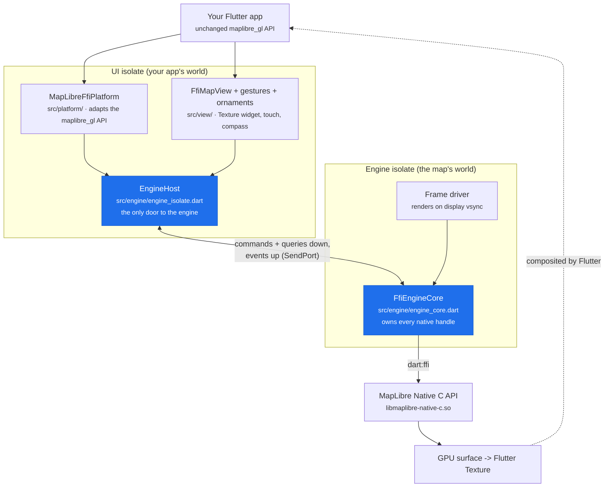
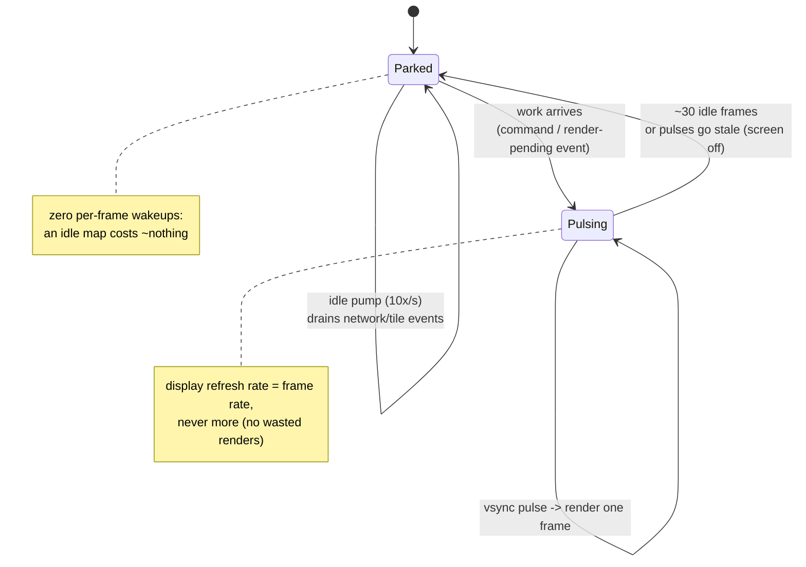

# Architecture

How the FFI engine works under the hood: what runs where, how a call travels, and where to put your hands when you want to change something. No isolate or FFI experience assumed.

## The big picture

Your app keeps using the regular `MapLibreMap` widget and `MapLibreMapController` from `maplibre_gl`: this package swaps what is behind them. Instead of a platform view driven over method channels, the map is the real MapLibre Native C++ engine, called directly from Dart through `dart:ffi`, drawing into a Flutter `Texture`.

The one idea that shapes everything: **the engine lives on its own isolate** (think: a second Dart thread with its own memory). Heavy work, like decoding and integrating map tiles into the GPU scene, happens there, so your UI never skips a frame because the map is busy.



Everything that crosses between the two worlds is a plain, sendable message defined in `src/engine/engine_protocol.dart`. Three kinds:

- **Command**: a fire-and-forget mutation ("move the camera", "set this GeoJSON"). No reply.
- **Query**: a read with a reply ("where does this coordinate land on screen?"). Round trip ~0.1 ms.
- **Event**: the engine pushing back ("style loaded", "camera changed", "map idle").

## One call, end to end

What happens when your app calls `controller.setGeoJsonSource(...)`:


And an event flowing the other way: a pan gesture changes the camera, the engine coalesces it to one `CameraIsChangingEvent` per rendered frame, the platform adapter turns it into `onCameraMove`, and the view updates the compass and scale bar (through `ValueNotifier`s, so only the ornament repaints, never the whole map widget).

## The frame loop

The engine renders when there is something to render, in phase with the display. A tiny native helper (the "vsync pulse" in `cpp/shim.c`) forwards Android's Choreographer ticks to the engine isolate:



If the vsync service is unavailable (very old devices, exotic failures), the driver logs loudly and falls back to a refresh-rate-matched timer.

Why a native pulse instead of a plain Dart timer? Because phase matters more than rate: a timer firing at the refresh rate but with no phase relation to the display beats against it and systematically misses the frame-latch deadline. Measured on the benchmark device (A/B with the timer fallback forced via `--dart-define=MLN_FORCE_TIMER_PACING=true`, 2026-07-23): the timer costs 30-36 % map fps in every gesture and tracking scenario (pan 75 -> 52 fps, tracking 80 -> 52) and more than doubles UI jank.

## Threading rules (the part that bites)

- MapLibre Native handles are **thread-affine**: only the engine isolate may touch them. That is why `FfiEngineCore` and its parts are the ONLY files importing `mln.*` types, and why everything else talks in protocol messages.
- The Dart VM sometimes migrates an isolate to a different OS thread. A watchdog detects this before every native call and rebinds the runtime (local upstream patch `mln_runtime_rebind_thread`). You will see a "runtime rebound" log line when it happens; that is normal.
- The vsync pulse thread never calls into MapLibre Native: it only posts a timestamp to the engine isolate's port.

## Directory map

| Directory | What lives there | Touch it when... |
|---|---|---|
| `src/engine/` | protocol, host, core (+ its parts), frame driver, vsync | you add engine capabilities or change how frames render |
| `src/view/` | `FfiMapView` (Texture + lifecycle), gestures, ornaments | you change touch behavior or on-map UI |
| `src/platform/` | the `MapLibrePlatform` adapter, offline API | you wire an existing engine capability to the public API |
| `src/io/` | HTTP resource provider, texture/platform channel bridge, style resolution, JSON converters | you change how bytes get in and out |
| `android/src/main/cpp/` | the C shim: `mln_android_init`, Vulkan bootstrap, vsync pulse | you need something only native code can do |

`engine_core.dart` is intentionally small: it holds the state and the frame pump. The dispatch lives in its `part` files (`engine_core_commands.dart`, `engine_core_queries.dart`, `engine_core_offline.dart`, `engine_core_snapshots.dart`, `engine_core_session.dart`): same library, same private access, just readable slices.

## Recipe: add a new map API in 4 steps

Say you want to expose `setFoo(double value)`. Every API in this package follows the same mechanical path; `setMaximumFps` is a small worked example to imitate.

1. **Protocol** (`src/engine/engine_protocol.dart`): declare the message. Sendable fields only (numbers, strings, bools, lists, maps, typed data).

   ```dart
   /// Sets foo on the session. (Command = mutation, no reply;
   /// use SessionQuery<R> instead if you need an answer.)
   class SetFooCommand extends SessionCommand {
     const SetFooCommand(super.sessionId, this.value);
     final double value;
   }
   ```

2. **Core** (`src/engine/engine_core_commands.dart`): handle it. The switch is exhaustive, so the analyzer points at the spot the moment you compile.

   ```dart
   case SetFooCommand():
     _session(command.sessionId).map.setFoo(command.value);
   ```

3. **Platform adapter** (`src/platform/ffi_platform.dart`): implement the `MapLibrePlatform` method by sending your message.

   ```dart
   @override
   Future<void> setFoo(double value) async {
     final (host, sessionId) = _requireSession();
     host.send(SetFooCommand(sessionId, value));
   }
   ```

4. **Public API** (in `maplibre_gl`): add the method to `MapLibreMapController` (and the platform interface if it is new there), delegating to the platform.

Run `dart analyze`, then the example gallery (`flutter run -t lib/main_ffi.dart` in `maplibre_gl_example`) to see it live. For performance work, the benchmark harness in `maplibre_gl_example/tool/bench/` is the regression net (see `docs/benchmarks/ffi-benchmarks.md` in this package).
