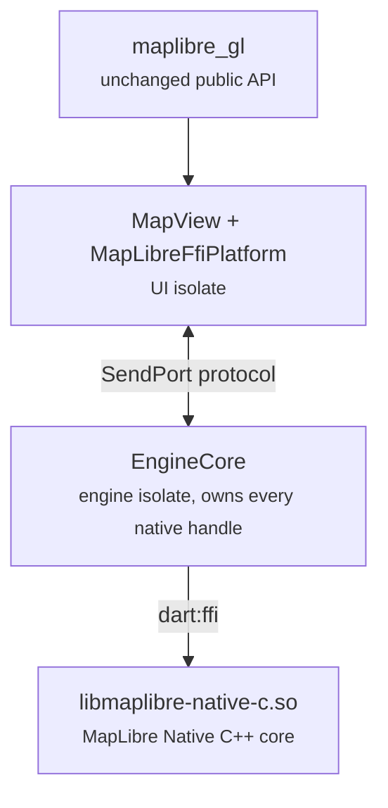

# maplibre_gl_native (EXPERIMENTAL SPIKE)

FFI backend for `maplibre_gl`: the map is driven directly through the [MapLibre Native C API](https://github.com/maplibre/maplibre-native-ffi) via `dart:ffi` and rendered into a Flutter `Texture`, replacing the platform-view plus method-channel architecture.

**Do not use this in production.** Android arm64 only, pre-1.0 native ABI.

## How it works

**Read [ARCHITECTURE.md](ARCHITECTURE.md)** for the guided tour with diagrams, the threading rules, and the "add a new map API in 4 steps" recipe. The stack in one breath:



The MapLibre runtime and maps live on a **dedicated engine isolate**: every command, query, and event crossing the boundary is isolate-sendable, and heavy tile-integration work never stalls the UI thread. (Benchmarks of the retired single-isolate mode against this architecture are in `../maplibre_gl_example/docs/benchmarks/ffi-benchmark-results-2026-07.md`; the isolate won everywhere, so it is now the only mode.) A `gettid` watchdog rebinds the runtime if the VM ever migrates the isolate across OS threads (the native handles are thread-affine; see `upstream_patches/`), and a failed isolate bootstrap throws instead of degrading silently.

**Drawing is not on that isolate.** The shim thread that owns the AChoreographer also owns the live render session and calls `render_update` itself, so no Dart work (GC, HTTP, a style parse) can delay a display frame. A render session's owner thread is checked on every entry point and Dart still needs several of them (feature queries, feature state, resize, surface replace, detach), so ownership ping-pongs under one mutex: those calls borrow the session back for the length of one call while renders, which are 60-90 times more frequent, simply keep it. Dart still pumps the runtime, still on the display pulse, because a resize reaches the map only through its owner thread and all tile and style work lands there.

- The only platform channel left is a small utility channel (`MapLibreGlNativePlugin`): `SurfaceProducer` texture lifecycle (create/resize/recreate/dispose), `mln_android_init`, the app cache directory for the persistent tile cache, opening attribution links, and the platform location stream. The JNI shim (`android/src/main/cpp/shim.c`) carries what only native code can do: the Vulkan instance/device/surface bootstrap, and the display-paced render service (AChoreographer) that draws the live session and paces the runtime pump.
- Gestures are implemented once in Dart (`MapGestureHandler`): pan with fling inertia, pinch, rotate, two-finger tilt, double-tap and two-finger-tap zoom, scroll-wheel zoom, tap/long-press events, and long-press feature drag, following the Android SDK's thresholds and animation formulas; camera writes reach the engine isolate as protocol commands.
- HTTP is native by default: the library's built-in Rust client serves styles, tiles, glyphs, and sprites. Its Android TLS verification used to reject most public CAs (rustls-platform-verifier [#221](https://github.com/rustls/rustls-platform-verifier/issues/221): CRL-only certificates, i.e. most of the web since CAs retired OCSP in 2025, were reported "Revoked"); upstream fixed it at the pinned commit by vendoring a patched verifier that follows the system trust manager's policy, like OkHttp (maplibre-native-ffi [#461](https://github.com/maplibre/maplibre-native-ffi/pull/461)). Custom headers (`setHttpHeaders`) ride the native client's header transforms (maplibre-native-ffi [#509](https://github.com/maplibre/maplibre-native-ffi/pull/509), which closed our [#492](https://github.com/maplibre/maplibre-native-ffi/issues/492)); the native transports also stop transformed headers from crossing origins on redirects. A Dart resource provider (`HttpResourceProvider`, `dart:io` `HttpClient`) remains for one case transforms cannot express, regex-filtered headers (`setCustomHeaders` with urlFilters): it is installed lazily when such a call arrives, sits behind the core's SQLite cache, and can be forced on for every request with `MLN_DART_HTTP=true`. It follows redirects itself (`http_redirect_policy.dart`) so configured headers never cross an origin change, and refuses https→http downgrades outright.
- Render backend is auto-detected: the bundled `libmaplibre-native-c.so` is compiled for one backend (OpenGL/EGL or **Vulkan**), the Dart side queries it (`mln_supported_render_backend_mask`) and the platform bridge prepares the matching surface. For Vulkan (the default the MapLibre Android SDK itself moved to), the shim bootstraps instance/device/queue and wraps the SurfaceProducer window in a `VkSurfaceKHR`; no EGL is involved and the engine stops sharing the GLES driver path with Flutter's compositor. The EGL variant wraps the `SurfaceProducer` surface in Kotlin via `EGL14` instead.

## Building the native library

The native library is **not** committed: build it once before running anything on this backend (without it the package does not even compile, because the ffigen bindings are generated in the same step). The bundled script does the whole dance: clone + pin + patches + toolchain + build + ffigen + strip + copy, and is safe to re-run:

```sh
cd maplibre_gl_native
tool/build_native.sh                  # Vulkan (recommended, what the spike ships)
tool/build_native.sh --backend egl    # OpenGL ES/EGL fallback for older devices
```

Prerequisites: `git`, a Flutter SDK on `PATH`, the Android SDK with an NDK 28.x, and [mise](https://mise.jdx.dev) (`brew install mise` on macOS, `curl https://mise.run | sh` on Linux). Tested on macOS and Linux; on Windows run it under WSL. `ANDROID_HOME` / `ANDROID_NDK_HOME` are honored when set, otherwise the Android Studio default paths for the host OS are assumed.

Pinned upstream state (update together):

- Repo: `maplibre/maplibre-native-ffi`, branch `main`, commit `14dca12967f2fdfee56073d4046fb70d5b775a08`. The Dart bindings that used to live in PR #187 were merged upstream on 2026-07-28.
- Clone location assumed by the `maplibre_native_ffi` path dependency: `../maplibre-native-ffi` (sibling of this repository's checkout).

The clone is a build artifact: the script resets it to the pin and re-applies the whole patch stack on every run, so a re-pin needs no manual cleanup. Run with `MLN_KEEP_CLONE=1` when you are editing that tree by hand and want the script to leave it alone.

The pinned tree needs the local patches in `upstream_patches/`, applied **in order** (they build on each other). Each one is one commit's worth of change. Seven earlier patches (prefix route matching, location-indicator axis order, provider URL canonicalization, style transition options, gesture-in-progress, whole-style JSON getter, surface replacement) were fixed upstream (issues #454-#460; surface replacement landed as the `set_target` family, #485) and are part of the pin. What remains is exactly the thread-affinity trio the #433 executor plan retires:

1. `0002-runtime-rebind-thread.patch`: `mln_runtime_rebind_thread`, required because the Dart VM may migrate an isolate across OS threads while every native handle is owner-thread affine.
2. `0009-lifecycle-rebind-owner-thread.patch`: **throwaway scaffolding, delete it rather than maintain it.** Upstream #399 added a Dart-side guard that throws when a handle's native thread token no longer matches, and `rebindThread()` (patch 0002) reads its handle through that guard, so the rebind is gated by the very check it exists to clear and the engine isolate dies seconds after the map opens. This makes the guard's thread-token branch heal instead of throwing. It disables a guard upstream added on purpose and is not upstreamable. Removing the engine isolate, or taking the awaits off it, retires this patch and probably 0002 with it.
3. `0010-render-session-rebind-thread.patch`: `mln_render_session_rebind_thread` (+ Dart wrapper and a handle-id accessor), which re-homes ONE render session to the calling thread. Two shapes need it and neither fits "the owner is whoever attached it": a host whose unit of execution is not pinned to an OS thread, and a host that draws on a display-paced callback thread while driving the map from elsewhere, which is what this backend now does. The same patch narrows `mln_runtime_rebind_thread` (patch 0002) to the runtime and its maps, because re-homing every session there would take one from whatever thread is drawing it.

<details>
<summary>Manual build steps (what the script does)</summary>

```sh
git clone --recurse-submodules https://github.com/maplibre/maplibre-native-ffi.git
cd maplibre-native-ffi
git checkout 14dca12967f2fdfee56073d4046fb70d5b775a08
git submodule update --init --recursive
for p in <this package>/upstream_patches/0*.patch; do git apply "$p"; done

# Toolchain (installs pinned cmake/ninja/rust/... into mise's own dirs)
export ANDROID_HOME="$HOME/Library/Android/sdk"   # Linux: $HOME/Android/Sdk
export ANDROID_NDK_HOME="$ANDROID_HOME/ndk/28.1.13356709"
mise trust --all
mise install
mise x -- rustup target add aarch64-linux-android

# Build (arm64-v8a). The preset is an argument: without it the task builds for
# the host, not for Android.
mise run //:build android-arm64-vulkan   # or android-arm64-egl

# Generate the ffigen bindings (maplibre_native_c.g.dart is gitignored upstream
# and must be generated before the Dart package compiles; `mise run
# //bindings/dart:ffigen` does the same when its toolchain bootstrap cooperates)
(cd bindings/dart && dart pub get && dart run tool/ffigen.dart)

# Strip and copy into this package
HOST_TAG=darwin-x86_64                            # Linux: linux-x86_64
NDK_BIN="$ANDROID_NDK_HOME/toolchains/llvm/prebuilt/$HOST_TAG/bin"
"$NDK_BIN/llvm-strip" --strip-unneeded \
  -o <this package>/android/src/main/jniLibs/arm64-v8a/libmaplibre-native-c.so \
  build/android-arm64-vulkan/libmaplibre-native-c.so   # same preset as above
```

</details>

The stripped library is ~15 MB (Vulkan) or ~13 MB (GL), self-contained: upstream links libc++ statically on Android since maplibre-native-ffi#481, so no `libc++_shared.so` ships beside it anymore.

`android/local_maven/` carries the `rustls-platform-verifier` JNI helper AAR that `mln_android_init` requires at initialization, as a one-artifact Maven repository because AGP forbids direct local `.aar` dependencies inside a library module. It is built from the pinned tree by `tool/build_native.sh` (upstream repackages the verifier's Android component under a MapLibre FFI-private Java package, so it coexists with an app that ships the stock Rustls helper; maplibre-native-ffi#461).

## Usage

```dart
import 'package:maplibre_gl_native/maplibre_gl_native.dart';

void main() {
  MapLibreGlNative.use(); // before runApp
  runApp(const MyApp());
}
```

Then use the regular `MapLibreMap` widget from `maplibre_gl`.

## Debug knobs

`--dart-define` switches for A/B measurement and diagnosis. All default to off; none is a supported mode.

| Define | Effect |
| --- | --- |
| `MLN_RENDER_ON_ISOLATE=true` | Draw on the engine isolate instead of the display pulse thread (the pre-display-thread architecture; the A/B arm that justified the thread). |
| `MLN_FORCE_TIMER_PACING=true` | Skip the choreographer pulses and pace frames with a refresh-rate-matched timer (the vsync A/B arm). |
| `MLN_DART_HTTP=true` | Install the Dart HTTP provider up front so it serves ALL http(s) requests (the pre-#461 default; A/B arm and provider regression testing). Without it the provider only activates for regex-filtered custom headers. |

## API coverage

Implemented:

- Camera: move/animate/ease, bounds fit, camera constraints (`setCameraBounds`, `cameraTargetBounds`, `minMaxZoomPreference`), content insets, visible region, projection (single/batch, both directions).
- Style: URL/JSON/`file://`/absolute-path/asset loading and `getStyle()` (patch 0004), sources (GeoJSON/vector/raster/raster-dem/image incl. add/update/remove and single-feature updates for annotation drag), layers of every type with add/remove, property updates (paint AND layout), visibility, filters, runtime images (`addImage`, sdf), introspection (layer/source ids, filter, visibility), `setMapLanguage`/`matchMapLanguageWithDeviceDefault`.
- Interaction: the full gesture set above, map click/long-click, feature taps (`enableInteraction` hit-testing, `featureTapsTriggersMapClick`) and feature drag (annotation drag), `queryRenderedFeatures` (point/rect), `querySourceFeatures`, feature state (set/get/remove; the method-channel backends throw on these).
- Events: style-loaded, camera move/idle, map idle, user-location, camera-tracking changed/dismissed, feature tapped/dragged.
- Location component: puck via the native `location-indicator` layer, platform location stream (permission must already be granted by the app), tracking modes with gesture dismissal, `requestMyLocationLatLng`.
- Ornaments: compass (auto-hidden when north-up, tap resets north), attribution (collapsible pill with per-source strings from the style and tappable links), the official MapLibre wordmark, an opt-in metric scale bar, all four corner positions plus margins.
- HTTP: all engine traffic through Dart's HTTP stack; per-map `setCustomHeaders` and process-global `MapLibreGlNative.setGlobalHttpHeaders`.
- Cache/network: persistent tile cache database in the app cache directory, `invalidateAmbientCache`/`clearAmbientCache`, `forceOnlineMode`, `setMaximumFps`.
- Snapshots: `takeSnapshot()` renders an offscreen still image (static-mode map sharing the live GPU context) and returns PNG bytes; an explicit `width`/`height` is honored at the session scale factor with the camera unchanged (an off-aspect size reveals more of the map, never distorts it).
- Offline regions: full engine plumbing plus the package-level `MapLibreGlNativeOffline` API mirroring `global.dart` (download with progress events, list, merge, metadata, status, pause/resume, delete, `setOffline`). The standard `global.dart` functions still reach the method-channel backends until the global-channel seam PR lands.
- Instrumentation: per-frame engine render stats behind `setFrameStatsEnabled`/`takeFrameStats`, consumed by the benchmark harness in `maplibre_gl_example/tool/bench/` (methodology and results in `maplibre_gl_example/docs/benchmarks/`).

Known gaps: `setOfflineTileCountLimit` and `setOfflineMaxConcurrentRequests` have no C API counterpart (no-ops); no RTL text plugin API upstream; `onFeatureHover`/mouse events are web-only; an animated GIF image source renders only its first frame (parity with the platform backends: animate by cycling `updateImageSource` with per-frame images); while location tracking is active, pinch zoom anchors on the gesture focal point rather than on the puck (the Android SDK anchors on the puck).

Run the full example gallery on this backend with:

```sh
cd maplibre_gl_example
flutter run -t lib/main_ffi.dart
```
