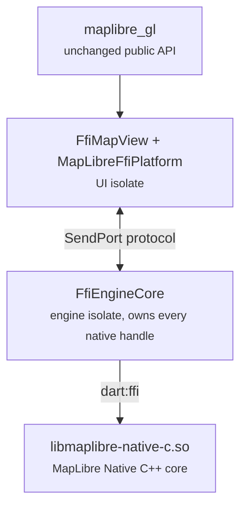

# maplibre_gl_native (EXPERIMENTAL SPIKE)

FFI backend for `maplibre_gl`: the map is driven directly through the [MapLibre Native C API](https://github.com/maplibre/maplibre-native-ffi) via `dart:ffi` and rendered into a Flutter `Texture`, replacing the platform-view plus method-channel architecture.

**Do not use this in production.** Android arm64 only, pre-1.0 native ABI.

## How it works

**Read [ARCHITECTURE.md](ARCHITECTURE.md)** for the guided tour with diagrams, the threading rules, and the "add a new map API in 4 steps" recipe. The stack in one breath:



The MapLibre runtime, maps, and rendering live on a **dedicated engine isolate**: every command, query, and event crossing the boundary is isolate-sendable, the engine drives its own display-vsync-paced frame loop there, and heavy tile-integration `renderUpdate` calls never stall the UI thread. (Benchmarks of the retired single-isolate mode against this architecture are in `docs/benchmarks/ffi-benchmark-results-2026-07.md`; the isolate won everywhere, so it is now the only mode.) A `gettid` watchdog rebinds the runtime if the VM ever migrates the isolate across OS threads (the native handles are thread-affine; see `upstream_patches/`), and a failed isolate bootstrap throws instead of degrading silently.

- The only platform channel left is a small utility channel (`MapLibreGlNativePlugin`): `SurfaceProducer` texture lifecycle (create/resize/recreate/dispose), `mln_android_init`, the app cache directory for the persistent tile cache, opening attribution links, and the platform location stream. The JNI shim (`android/src/main/cpp/shim.c`, ~380 lines) carries what only native code can do: the Vulkan instance/device/surface bootstrap and the display-vsync pulse (AChoreographer) that paces the engine frame loop.
- Gestures are implemented once in Dart (`MapGestureHandler`): pan with fling inertia, pinch, rotate, two-finger tilt, double-tap and two-finger-tap zoom, scroll-wheel zoom, tap/long-press events, and long-press feature drag, following the Android SDK's thresholds and animation formulas; camera writes reach the engine isolate as protocol commands.
- HTTP is Dart-owned: a resource provider (`HttpResourceProvider`) intercepts every http(s) request (styles, tiles, glyphs, sprites) and serves it with `dart:io`'s `HttpClient`, bypassing the library's built-in Rust HTTP/TLS stack (rustls-platform-verifier rejected valid certificates with "invalid peer certificate: Revoked" on some devices). This is also the seam where `setHttpHeaders` support will land.
- Render backend is auto-detected: the bundled `libmaplibre-native-c.so` is compiled for one backend (OpenGL/EGL or **Vulkan**), the Dart side queries it (`mln_supported_render_backend_mask`) and the platform bridge prepares the matching surface. For Vulkan (the default the MapLibre Android SDK itself moved to), the shim bootstraps instance/device/queue and wraps the SurfaceProducer window in a `VkSurfaceKHR`; no EGL is involved and the engine stops sharing the GLES driver path with Flutter's compositor. The EGL variant wraps the `SurfaceProducer` surface in Kotlin via `EGL14` instead.

## Building the native library

The native library is **not** committed: build it once before running anything on this backend (without it the package does not even compile, because the ffigen bindings are generated in the same step). The bundled script does the whole dance: clone + pin + patches + toolchain + build + ffigen + strip + copy, and is safe to re-run:

```sh
cd maplibre_gl_native
tool/build_native.sh                  # Vulkan (recommended, what the spike ships)
tool/build_native.sh --backend egl    # OpenGL ES/EGL fallback for older devices
```

Prerequisites: `git`, a Flutter SDK on `PATH`, the Android SDK with an NDK 28.x, and [mise](https://mise.jdx.dev) (`brew install mise` on macOS, `curl https://mise.run | sh` on Linux). Tested on macOS and Linux; on Windows run it under WSL. `ANDROID_HOME` / `ANDROID_NDK_HOME` are honored when set, otherwise the Android Studio default paths for the host OS are assumed.

Pinned upstream state (update together):

- Repo: `maplibre/maplibre-native-ffi`, branch `dart` (PR #187), commit `9b2934e8feab7259a45b1def192ca1c13e8f603b`.
- Clone location assumed by the `maplibre_native_ffi` path dependency: `../maplibre-native-ffi` (sibling of this repository's checkout).

The pinned tree needs the local patches in `upstream_patches/`; the script applies them **in order** and skips any already applied. All are proposed for upstreaming:

1. `0001-dart-shim-prefix-route-match.patch`: trailing-`*` prefix matching for Dart resource-provider routes (the pinned code matches exact URLs only, which makes intercepting tile/glyph/sprite URL families impossible).
2. `0002-runtime-rebind-thread.patch`: `mln_runtime_rebind_thread`, required because the Dart VM may migrate an isolate across OS threads while every native handle is owner-thread affine.
3. `0003-render-session-replace-surface.patch`: `mln_render_session_release_surface` and `mln_render_session_replace_surface`, which swap the native surface of a live render session while keeping the renderer and its GPU resources. Without it every surface recreation (Android rotation/resize) tears the session down and visibly re-renders the map from scratch.
4. `0004-map-copy-style-json.patch`: `mln_map_copy_style_json`, which copies the current style as a full style-spec JSON document (the C API only had the setter). Needed by the `getStyle()` platform method.
5. `0005-location-indicator-lat-lng-order.patch`: bug fix. `mln_map_set_location_indicator_location` built the `location` property in GeoJSON order `[lng, lat, altitude]`, but the location-indicator style-spec property is `[latitude, longitude, altitude]`; the puck rendered at swapped coordinates (invisible unless at Null Island).
6. `0006-canonicalize-url-before-custom-provider.patch`: bug fix. Scheme-alias URLs (`maplibre://tiles` in the demotiles style) were matched against custom-provider routes BEFORE canonicalization, so they never matched the provider's `http(s)://*` routes and silently fell through to the built-in Rust HTTP client (which fails TLS verification on some devices). The patch applies the same per-kind URL normalization that `OnlineFileSource::request` performs, before provider dispatch.
7. `0007-style-transition-options.patch`: `mln_map_set_style_transition_options` (+ Dart wrapper), exposing `mbgl::style::TransitionOptions` incl. `enablePlacementTransitions`, which the Android SDK exposes as `Style.setTransition`. The backend disables placement cross-fade for the duration of a feature drag so per-move symbol updates apply instantly instead of trailing by the ~300ms fade.
8. `0008-map-set-gesture-in-progress.patch`: `mln_map_set_gesture_in_progress` (+ Dart wrapper), exposing `mbgl::Map::setGestureInProgress`. The platform SDKs bracket every touch gesture with it; the gesture handler mirrors that (set on the first pointer down, cleared on the last pointer up).

<details>
<summary>Manual build steps (what the script does)</summary>

```sh
git clone --recurse-submodules https://github.com/maplibre/maplibre-native-ffi.git
cd maplibre-native-ffi
git checkout 9b2934e8feab7259a45b1def192ca1c13e8f603b
git submodule update --init --recursive
for p in <this package>/upstream_patches/0*.patch; do git apply "$p"; done

# Toolchain (installs pinned cmake/ninja/rust/... into mise's own dirs)
export ANDROID_HOME="$HOME/Library/Android/sdk"   # Linux: $HOME/Android/Sdk
export ANDROID_NDK_HOME="$ANDROID_HOME/ndk/28.1.13356709"
export MISE_ENV=android-arm64-vulkan              # or android-arm64-egl
mise trust --all
mise install
mise x -- rustup target add aarch64-linux-android

# Build (arm64-v8a)
mise run //:build

# Generate the ffigen bindings (maplibre_native_c.g.dart is gitignored
# upstream and must be generated before the Dart package compiles; the
# `mise run //bindings/dart:ffigen` task does the same when its rust
# toolchain bootstrap cooperates)
(cd bindings/dart && dart pub get && dart run ffigen --config ffigen.yaml)

# Strip and copy into this package
HOST_TAG=darwin-x86_64                            # Linux: linux-x86_64
NDK_BIN="$ANDROID_NDK_HOME/toolchains/llvm/prebuilt/$HOST_TAG/bin"
"$NDK_BIN/llvm-strip" --strip-unneeded \
  -o <this package>/android/src/main/jniLibs/arm64-v8a/libmaplibre-native-c.so \
  build/$MISE_ENV/libmaplibre-native-c.so
```

</details>

The stripped library is ~15 MB (Vulkan) or ~13 MB (GL) and links only against Android system libraries (no `libc++_shared`).

`android/local_maven/` vendors the tiny (9 KB) `rustls-platform-verifier` Android component that `mln_android_init` requires at initialization; it is not published to Maven Central and ships with the Rust crate of the same name. With the Dart HTTP resource provider installed the Rust TLS stack is no longer on the request path, but initialization still requires the component.

## Usage

```dart
import 'package:maplibre_gl_native/maplibre_gl_native.dart';

void main() {
  MapLibreGlNative.use(); // before runApp
  runApp(const MyApp());
}
```

Then use the regular `MapLibreMap` widget from `maplibre_gl`.

## API coverage

Implemented:

- Camera: move/animate/ease, bounds fit, camera constraints (`setCameraBounds`, `cameraTargetBounds`, `minMaxZoomPreference`), content insets, visible region, projection (single/batch, both directions).
- Style: URL/JSON/`file://`/absolute-path/asset loading and `getStyle()` (patch 0004), sources (GeoJSON/vector/raster/raster-dem/image incl. add/update/remove and single-feature updates for annotation drag), layers of every type with add/remove, property updates (paint AND layout), visibility, filters, runtime images (`addImage`, sdf), introspection (layer/source ids, filter, visibility), `setMapLanguage`/`matchMapLanguageWithDeviceDefault`.
- Interaction: the full gesture set above, map click/long-click, feature taps (`enableInteraction` hit-testing, `featureTapsTriggersMapClick`) and feature drag (annotation drag), `queryRenderedFeatures` (point/rect), `querySourceFeatures`, feature state (set/get/remove; the method-channel backends throw on these).
- Events: style-loaded, camera move/idle, map idle, user-location, camera-tracking changed/dismissed, feature tapped/dragged.
- Location component: puck via the native `location-indicator` layer, platform location stream (permission must already be granted by the app), tracking modes with gesture dismissal, `requestMyLocationLatLng`.
- Ornaments: compass (auto-hidden when north-up, tap resets north), attribution (collapsible pill with per-source strings from the style and tappable links), the official MapLibre wordmark, an opt-in metric scale bar, all four corner positions plus margins.
- HTTP: all engine traffic through Dart's HTTP stack; per-map `setCustomHeaders` and process-global `MapLibreGlNative.setGlobalHttpHeaders`.
- Cache/network: persistent tile cache database in the app cache directory, `invalidateAmbientCache`/`clearAmbientCache`, `forceOnlineMode`, `setMaximumFps`.
- Snapshots: `takeSnapshot()` renders an offscreen still image (static-mode map sharing the live GPU context) and returns PNG bytes.
- Offline regions: full engine plumbing plus the package-level `MapLibreGlNativeOffline` API mirroring `global.dart` (download with progress events, list, merge, metadata, status, pause/resume, delete, `setOffline`). The standard `global.dart` functions still reach the method-channel backends until the global-channel seam PR lands.
- Instrumentation: per-frame engine render stats behind `setFrameStatsEnabled`/`takeFrameStats`, consumed by the benchmark harness in `maplibre_gl_example/tool/bench/` (see `docs/benchmarks/`).

Known gaps: explicit `takeSnapshot(width:, height:)` sizes render at the current surface size; `setOfflineTileCountLimit` and `setOfflineMaxConcurrentRequests` have no C API counterpart (no-ops); no RTL text plugin API upstream; `onFeatureHover`/mouse events are web-only; an animated GIF image source renders only its first frame (parity with the platform backends: animate by cycling `updateImageSource` with per-frame images); while location tracking is active, pinch zoom anchors on the gesture focal point rather than on the puck (the Android SDK anchors on the puck).

Run the full example gallery on this backend with:

```sh
cd maplibre_gl_example
flutter run -t lib/main_ffi.dart
```
