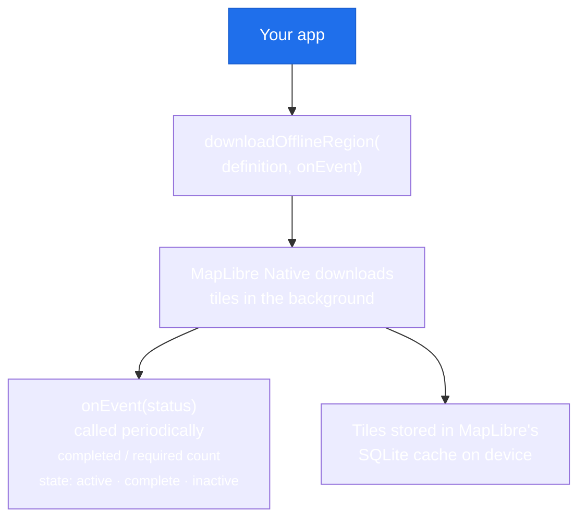

# Offline Regions

Offline regions allow users to download a geographic area and use the map without internet access. The map tiles, fonts, and sprites are all stored on-device.

!!! warning "Android and iOS only"
    MapLibre GL JS (web) has no offline API. The offline region feature is only available on Android and iOS. Guard all offline code with `if (!kIsWeb)`.

## How it works



Once downloaded, the map works offline automatically; no code change needed. When a region is in the cache and the device is offline, MapLibre serves tiles from the local store.

## Step 1: Define the region

`OfflineRegionDefinition` describes what to download:

```dart
import 'package:maplibre_gl/maplibre_gl.dart';

final definition = OfflineRegionDefinition(
  bounds: LatLngBounds(
    southwest: const LatLng(48.7, 2.2),  // Paris area
    northeast: const LatLng(49.0, 2.5),
  ),
  minZoom: 10.0,   // download from zoom 10
  maxZoom: 16.0,   // to zoom 16 (street level)
  mapStyleUrl: MapLibreStyles.openfreemapLiberty,
  includeIdeographs: false,  // set true for CJK character support
);
```

!!! tip "Tile count warning"
    Tile count grows exponentially with zoom levels. A 10×10 km area at zoom 10–16 can be thousands of tiles. Use [MapLibre's tile estimator](https://docs.maplibre.org) to estimate size before prompting users.

## Step 2: Download with a progress callback

```dart
import 'package:flutter/foundation.dart'; // for kIsWeb

Future<void> downloadRegion() async {
  if (kIsWeb) return; // offline not supported on web

  final region = await downloadOfflineRegion(
    definition,
    metadata: {'name': 'Paris Center'},  // arbitrary metadata
    onEvent: (OfflineRegionStatus status) {
      final progress = status.requiredResourceCount > 0
          ? status.completedResourceCount / status.requiredResourceCount
          : 0.0;

      setState(() => _progress = progress);

      if (status.downloadState == OfflineRegionDownloadState.complete) {
        print('Download complete! Region ID: ${region.id}');
      }
    },
  );
}
```

`downloadOfflineRegion` returns an `OfflineRegion` object with the assigned `id`. Store this ID if you need to delete the region later.

## Step 3: Track progress in UI

```dart
double _progress = 0.0;
bool _isDownloading = false;

// In your build():
if (_isDownloading)
  LinearProgressIndicator(value: _progress)
else
  ElevatedButton(
    onPressed: _startDownload,
    child: const Text('Download for offline'),
  )
```

### `OfflineRegionStatus` fields

| Field | Description |
|---|---|
| `completedResourceCount` | Tiles + assets downloaded so far |
| `requiredResourceCount` | Total tiles + assets needed |
| `completedResourceSize` | Bytes downloaded |
| `downloadState` | `active`, `complete`, or `inactive` |

Progress percentage: `completedResourceCount / requiredResourceCount * 100`

## List downloaded regions

```dart
final List<OfflineRegion> regions = await getListOfRegions();

for (final region in regions) {
  print('Region ${region.id}: ${region.metadata}');
  print('  Bounds: ${region.definition.bounds}');
  print('  Zooms: ${region.definition.minZoom} - ${region.definition.maxZoom}');
}
```

Use this to show users what they've downloaded and offer delete options.

## Check region status

```dart
final status = await getOfflineRegionStatus(region.id);
print('Downloaded: ${status.completedResourceCount} tiles');
print('Complete: ${status.downloadState == OfflineRegionDownloadState.complete}');
```

## Delete a region

```dart
await deleteOfflineRegion(region.id);
```

Frees the storage on device. If the user goes offline after deletion, those tiles are no longer available.

## Complete example pattern

```dart
class OfflineDownloadManager {
  OfflineRegion? _region;
  double _progress = 0.0;

  Future<void> startDownload(LatLngBounds bounds) async {
    if (kIsWeb) return;

    final definition = OfflineRegionDefinition(
      bounds: bounds,
      minZoom: 10,
      maxZoom: 15,
      mapStyleUrl: MapLibreStyles.openfreemapLiberty,
    );

    _region = await downloadOfflineRegion(
      definition,
      onEvent: (status) {
        _progress = status.requiredResourceCount > 0
            ? status.completedResourceCount / status.requiredResourceCount
            : 0.0;
        notifyListeners(); // or setState
      },
    );
  }

  Future<void> deleteDownload() async {
    if (_region != null) {
      await deleteOfflineRegion(_region!.id);
      _region = null;
    }
  }
}
```

## Storage considerations

- Tiles are stored in MapLibre's SQLite database on device
- iOS: stored in the app's Library/Caches (may be cleared by the OS under low storage)
- Android: stored in the app's internal storage
- Maximum tile count per region: 6,000 tiles by default (configurable at the native SDK level)
- Typical sizes: city center at zoom 10–15 ≈ 20–100 MB

!!! note "Style assets"
    The offline download includes tiles, fonts, and sprites needed by the style URL. If you later change the style URL, previously downloaded regions may not display correctly.

## Key APIs

| Function | Description |
|---|---|
| `downloadOfflineRegion(definition, onEvent)` | Start a download, get status callbacks |
| `getListOfRegions()` | List all downloaded regions |
| `getOfflineRegionStatus(id)` | Check status of a specific region |
| `deleteOfflineRegion(id)` | Delete a downloaded region |
