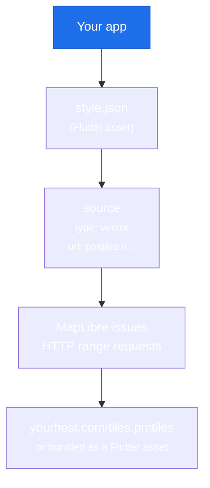

# PMTiles

PMTiles is a single-file archive format for storing map tiles. Instead of a tile server that serves individual `/{z}/{x}/{y}` requests, you serve (or bundle) one `.pmtiles` file. MapLibre reads ranges from it directly using HTTP range requests.

<iframe
  class="example-iframe"
  src="https://maplibre.github.io/flutter-maplibre-gl/?example=doc-pmtiles"
  title="PMTiles example"
  loading="lazy"
></iframe>

## Why PMTiles?

| Traditional tile server | PMTiles |
|---|---|
| Requires running server | Static file hosting |
| Complex infrastructure | Upload one file |
| Per-request cost | Flat storage cost |
| Hard to version | Just replace the file |

PMTiles is ideal for: offline-capable apps, self-hosted tile data, distributing maps without a backend, and reducing operational complexity.

## How it works



MapLibre handles the `pmtiles://` protocol internally. No Flutter-side code is needed beyond pointing the style at the right URL.

## Step 1: Get a `.pmtiles` file

Options:

- Download from [protomaps.com/downloads](https://protomaps.com/downloads) (world extracts)
- Convert an MBTiles file: `pmtiles convert input.mbtiles output.pmtiles`
- Generate from OpenStreetMap with [planetiler](https://github.com/onthegomap/planetiler)

For testing, use the Protomaps public CDN:
```
https://build.protomaps.com/20231001.pmtiles
```

## Step 2: Create a style JSON

The style JSON references the PMTiles archive as a vector source. Save this as `assets/pmtiles_style.json`:

```json
{
  "version": 8,
  "glyphs": "https://demotiles.maplibre.org/font/{fontstack}/{range}.pbf",
  "sources": {
    "protomaps": {
      "type": "vector",
      "url": "pmtiles://https://build.protomaps.com/20231001.pmtiles",
      "attribution": "© OpenStreetMap"
    }
  },
  "layers": [
    {
      "id": "background",
      "type": "background",
      "paint": { "background-color": "#e8f4f8" }
    },
    {
      "id": "water",
      "type": "fill",
      "source": "protomaps",
      "source-layer": "water",
      "paint": { "fill-color": "#a8d5e5" }
    },
    {
      "id": "roads",
      "type": "line",
      "source": "protomaps",
      "source-layer": "roads",
      "paint": {
        "line-color": "#ffffff",
        "line-width": ["interpolate", ["linear"], ["zoom"], 8, 0.5, 14, 4]
      }
    },
    {
      "id": "places",
      "type": "symbol",
      "source": "protomaps",
      "source-layer": "places",
      "layout": {
        "text-field": "{name}",
        "text-size": 12
      },
      "paint": {
        "text-color": "#333",
        "text-halo-color": "#fff",
        "text-halo-width": 1
      }
    }
  ]
}
```

The `source-layer` names (`water`, `roads`, `places`) depend on the PMTiles schema. Protomaps uses [its own schema](https://docs.protomaps.com/vector-tiles/schema).

## Step 3: Register the asset in pubspec.yaml

```yaml
flutter:
  assets:
    - assets/pmtiles_style.json
```

## Step 4: Load it in Flutter

```dart
MapLibreMap(
  styleString: 'assets/pmtiles_style.json',
  initialCameraPosition: const CameraPosition(
    target: LatLng(48.85, 2.35),
    zoom: 10,
  ),
)
```

That's it. No additional Flutter code is needed. MapLibre handles the `pmtiles://` protocol.

## Step 5: Add style layers programmatically (optional)

You can add more layers on top after the style loads, just like any other source:

```dart
MapLibreMap(
  styleString: 'assets/pmtiles_style.json',
  onStyleLoadedCallback: _onStyleLoaded,
)

Future<void> _onStyleLoaded() async {
  // The style already has the PMTiles source loaded as 'protomaps'
  // Add an extra highlight layer on top
  await controller.addFillLayer(
    'protomaps',
    'parks-highlight',
    const FillLayerProperties(
      fillColor: '#4CAF50',
      fillOpacity: 0.3,
    ),
    filter: ['==', ['get', 'kind'], 'park'],
  );
}
```

## Hosting options

| Option | Use case |
|---|---|
| **Bundled asset** | Offline apps, small regional extracts (<50 MB practical limit) |
| **GitHub Releases** | Free hosting via CDN, good for small-medium files |
| **Cloudflare R2** | S3-compatible, free egress, ideal for large files |
| **AWS S3** | Production, large scale |
| **Protomaps CDN** | Public world basemap, free for reasonable usage |

## Platform support

PMTiles works on **all platforms**: Android, iOS, and Web. The `pmtiles://` protocol is handled by the MapLibre engine on each platform.

!!! tip "Offline + PMTiles"
    PMTiles and offline regions are separate features. PMTiles reduces server dependency but still requires network access for HTTP range requests. For truly offline use, bundle the `.pmtiles` file as a Flutter asset and reference it with a local path.
