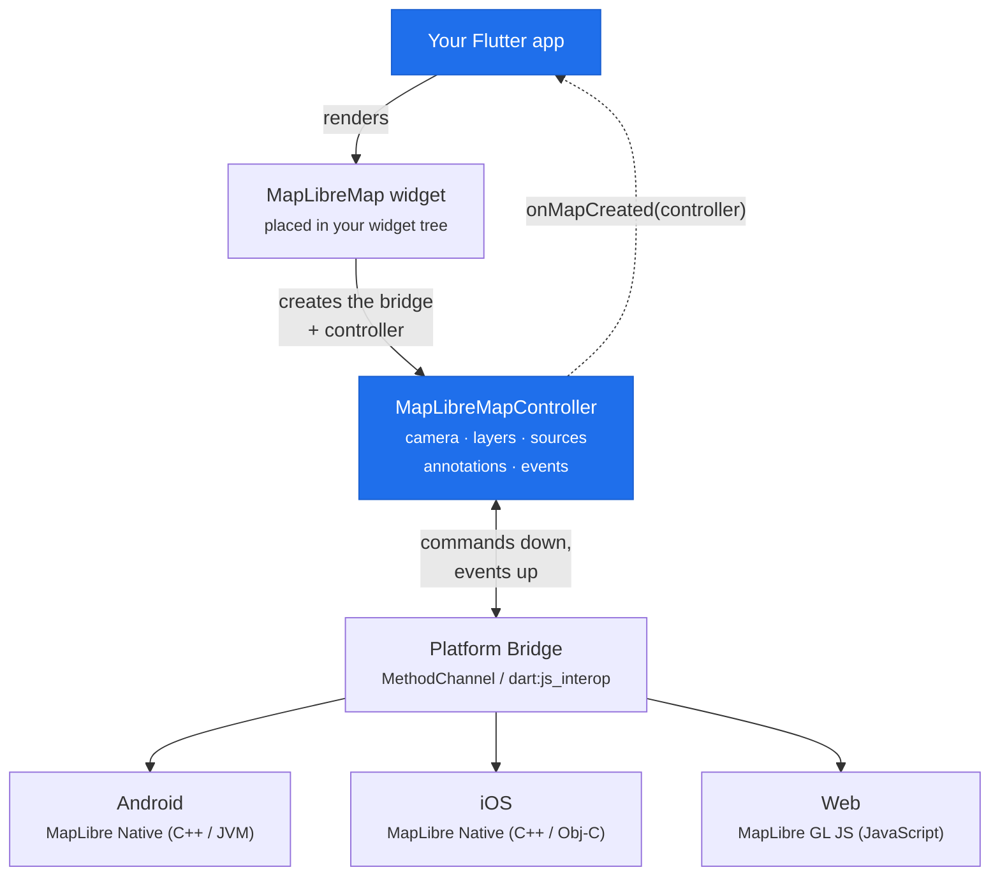
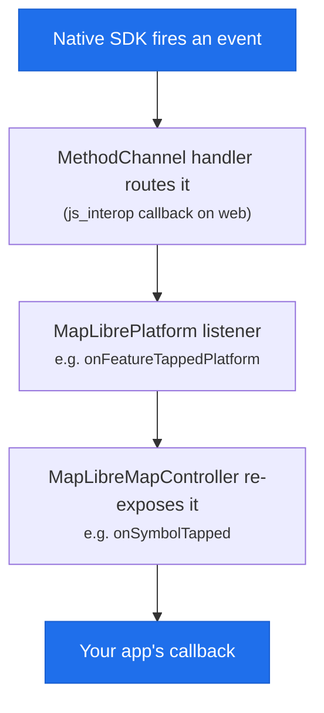

# Architecture

Understanding how flutter-maplibre-gl works under the hood helps you write better code, debug issues faster, and know when to use `kIsWeb` guards.

## The three-layer stack



### Layer 1: The Flutter widget

`MapLibreMap` is a Flutter widget that embeds a native map view using a [Platform View](https://docs.flutter.dev/platform-integration/platform-views). It is **not** drawn by Flutter's Skia/Impeller renderer, the map is rendered natively at full GPU speed by MapLibre's C++ engine.

This means:

- Maps look and perform identically to native apps
- Custom Flutter widgets painted *over* the map work fine (use `Stack`)
- Custom Flutter widgets *inside* the map tile layer are not possible

### Layer 2: The controller

`MapLibreMapController` is the Dart-side handle to the running map. You get it in the `onMapCreated` callback:

```dart
MapLibreMap(
  onMapCreated: (MapLibreMapController controller) {
    // controller is now ready
  },
)
```

The widget creates the controller (and the platform bridge) once the native view is ready, then hands it to you through `onMapCreated`. From that point the controller talks to the bridge **directly**, not through the widget: it sends operations down (camera movement, adding layers and sources, managing annotations, querying features, taking snapshots) and receives events back up (taps, drags, camera moves) as streams.

### Layer 3: The platform bridge

On **Android and iOS**, the controller communicates with the native MapLibre SDK via a `MethodChannel` named `plugins.flutter.io/maplibre_gl_<id>`. Each method call crosses the Dart-to-native boundary.

On **Web**, there is no MethodChannel. Instead, the web implementation uses `dart:js_interop` to call MapLibre GL JS directly in the browser. The same `MapLibreMapController` API is exposed, but the underlying calls go to JavaScript.

## Platform differences

Some features are only available on certain platforms:

<div class="table-scroll" markdown>
<table class="comparison-table comparison-table--matrix">
  <thead>
    <tr><th>Feature</th><th>Android</th><th>iOS</th><th>Web</th></tr>
  </thead>
  <tbody>
    <tr><td>Offline regions</td><td><span class="cell-ic"><span class="ic ic--yes">✔</span></span></td><td><span class="cell-ic"><span class="ic ic--yes">✔</span></span></td><td><span class="cell-ic"><span class="ic ic--no">✘</span></span></td></tr>
    <tr><td>Hover events</td><td><span class="cell-ic"><span class="ic ic--no">✘</span></span></td><td><span class="cell-ic"><span class="ic ic--no">✘</span></span></td><td><span class="cell-ic"><span class="ic ic--yes">✔</span></span></td></tr>
    <tr><td>Image sources</td><td><span class="cell-ic"><span class="ic ic--yes">✔</span></span></td><td><span class="cell-ic"><span class="ic ic--yes">✔</span></span></td><td><span class="cell-ic"><span class="ic ic--mid">●</span> Limited</span></td></tr>
    <tr><td>GeoJSON sources</td><td><span class="cell-ic"><span class="ic ic--yes">✔</span></span></td><td><span class="cell-ic"><span class="ic ic--yes">✔</span></span></td><td><span class="cell-ic"><span class="ic ic--yes">✔</span></span></td></tr>
    <tr><td>PMTiles</td><td><span class="cell-ic"><span class="ic ic--yes">✔</span></span></td><td><span class="cell-ic"><span class="ic ic--yes">✔</span></span></td><td><span class="cell-ic"><span class="ic ic--yes">✔</span></span></td></tr>
    <tr><td>Camera animation interpolation</td><td><span class="cell-ic"><span class="ic ic--yes">✔</span></span></td><td><span class="cell-ic"><span class="ic ic--yes">✔</span></span></td><td><span class="cell-ic"><span class="ic ic--mid">●</span> Partial</span></td></tr>
  </tbody>
</table>
</div>

<span class="ic ic--yes">✔</span> supported &nbsp;·&nbsp; <span class="ic ic--mid">●</span> partial &nbsp;·&nbsp; <span class="ic ic--no">✘</span> not available
{ .legend }

Use `kIsWeb` from `package:flutter/foundation.dart` to guard platform-specific code:

```dart
import 'package:flutter/foundation.dart';

if (!kIsWeb) {
  // offline regions, etc.
}

if (kIsWeb) {
  // hover effects, etc.
}
```

## Hybrid composition (Android)

On Android, Flutter offers two platform view rendering modes:

- **Virtual displays** (default on older Android): renders into an off-screen surface
- **Hybrid composition**: composites the native view directly into the Flutter layer tree

For better touch handling and performance on Android 10+, you can enable hybrid composition:

```dart
MapLibreMap.useHybridComposition = true; // call before runApp()
```

The example app sets this automatically based on the Android SDK version.

## Callback lifecycle

Events flow the other way, from native up to your Dart callback:



Always check `if (mounted)` before calling `setState()` inside async callbacks, as the widget may have been disposed by the time the native callback arrives.

## Next steps

- [Annotations vs Style Layers](annotations-vs-layers.md): the two APIs for putting data on the map
- [Working with GeoJSON](geojson.md): the data format underlying everything
