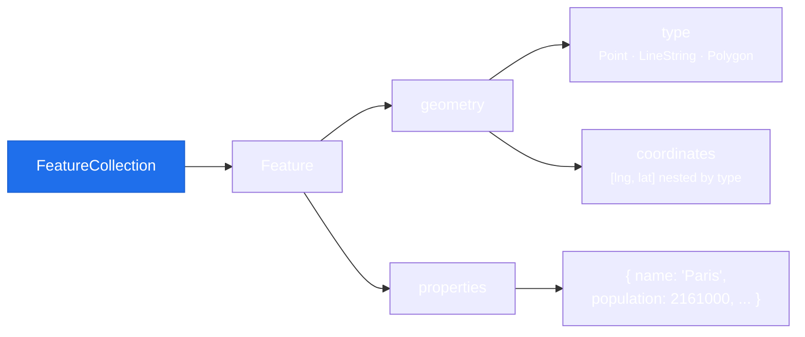

# Working with GeoJSON

GeoJSON is the data format that powers everything in MapLibre. Whether you're adding a symbol layer, a cluster, or a heatmap, the data comes from a GeoJSON source. Understanding GeoJSON unlocks the full power of style layers.

## What is GeoJSON?

GeoJSON (RFC 7946) is a JSON format for geographic features. A **FeatureCollection** contains any number of **Features**, each of which has a **Geometry** (the shape) and **Properties** (arbitrary metadata).



!!! note "Longitude before latitude"
    GeoJSON uses `[longitude, latitude]` order, the opposite of `LatLng(lat, lng)` in Flutter. This is a common source of bugs.

## The three geometry types

### Point

A single geographic location.

```dart
{
  'type': 'Feature',
  'properties': {'name': 'Eiffel Tower'},
  'geometry': {
    'type': 'Point',
    'coordinates': [2.2945, 48.8584], // [lng, lat]
  },
}
```

### LineString

An ordered sequence of points forming a line.

```dart
{
  'type': 'Feature',
  'properties': {'route': 'Paris - Berlin'},
  'geometry': {
    'type': 'LineString',
    'coordinates': [
      [2.3522, 48.8566],   // Paris [lng, lat]
      [13.4050, 52.5200],  // Berlin
    ],
  },
}
```

### Polygon

A closed ring of coordinates (first and last point must be identical).

```dart
{
  'type': 'Feature',
  'properties': {'name': 'Zone A'},
  'geometry': {
    'type': 'Polygon',
    'coordinates': [
      [
        [2.0, 48.5],
        [2.5, 48.5],
        [2.5, 49.0],
        [2.0, 49.0],
        [2.0, 48.5], // close the ring
      ]
    ],
  },
}
```

## Using properties in expressions

Properties are what make style layers powerful. Any feature property can drive the visual appearance of that feature via [expressions](../advanced/expressions.md).

```dart
// Property access in a layer
SymbolLayerProperties(
  textField: [Expressions.get, 'name'],         // show 'name' property as label
  textSize: [Expressions.get, 'font_size'],     // drive size from data
  iconColor: [Expressions.get, 'color'],        // drive color from data
)
```

## Adding a GeoJSON source

### Inline data

Pass a Dart `Map<String, dynamic>` representing the FeatureCollection:

```dart
await controller.addGeoJsonSource('my-source', {
  'type': 'FeatureCollection',
  'features': [
    {
      'type': 'Feature',
      'properties': {'name': 'Paris', 'population': 2161000},
      'geometry': {
        'type': 'Point',
        'coordinates': [2.3522, 48.8566],
      },
    },
  ],
});
```

### Remote URL

Pass a URL string as the GeoJSON value. MapLibre fetches and parses it:

```dart
await controller.addGeoJsonSource('rivers', {
  'type': 'geojson',
  'data': 'https://example.com/rivers.geojson',
});
```

!!! warning "CORS on web"
    When running on web, the GeoJSON URL must have appropriate CORS headers. Requests to the same origin always work.

## Updating data

### Replace all features

```dart
await controller.setGeoJsonSource('my-source', {
  'type': 'FeatureCollection',
  'features': updatedFeatures,
});
```

Use this when the dataset changes significantly (e.g. filtering, time-series playback).

### Update a single feature

```dart
await controller.setGeoJsonFeature('my-source', {
  'type': 'Feature',
  'id': 'feature-42',  // must match an existing feature id
  'properties': {'status': 'active'},
  'geometry': {
    'type': 'Point',
    'coordinates': [2.3522, 48.8566],
  },
});
```

For this to work, features must have an `id` field. On web you may also need `promoteId` (see below).

## `promoteId`: web-only caveat

MapLibre GL JS requires features to have an integer ID for feature-state to work correctly. If your GeoJSON uses string IDs or property-based IDs, pass `promoteId`:

```dart
await controller.addGeoJsonSource(
  'my-source',
  geojsonData,
  promoteId: 'myIdProperty', // promotes this property to be the feature ID
);
```

This parameter is ignored on Android and iOS (native MapLibre handles feature IDs natively).

## Live demo

<iframe
  class="example-iframe"
  src="/flutter-maplibre-gl/?example=doc-geojson-source"
  title="GeoJSON source"
  loading="lazy"
></iframe>

South American capitals rendered from an inline GeoJSON FeatureCollection. Circle radius scales with population using an `interpolate` expression.

## Next steps

- [Data-Driven Expressions](../advanced/expressions.md): use properties to drive styles
- [Annotations vs Style Layers](annotations-vs-layers.md): when to use GeoJSON sources vs the annotation API
