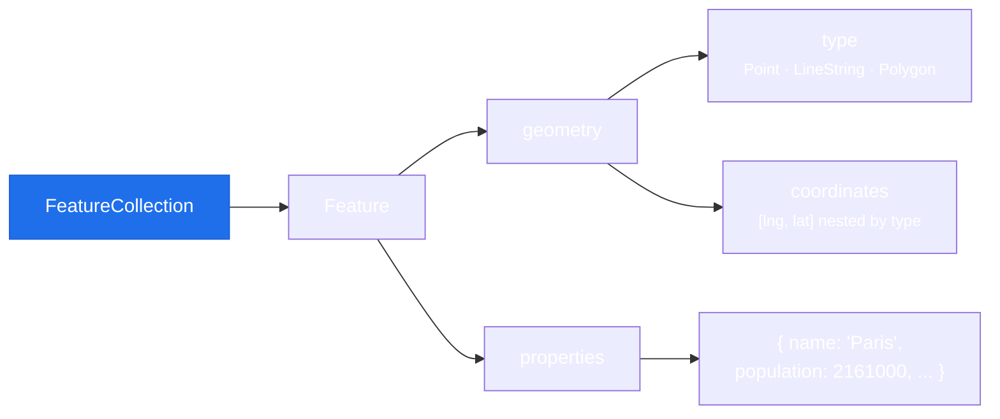

# Working with GeoJSON

GeoJSON is the data format that powers everything in MapLibre. Whether you're adding a symbol layer, a cluster, or a heatmap, the data comes from a GeoJSON source. Understanding GeoJSON unlocks the full power of style layers.

## What is GeoJSON?

GeoJSON (RFC 7946) is a JSON format for geographic features. A **FeatureCollection** contains any number of **Features**, each of which has a **Geometry** (the shape) and **Properties** (arbitrary metadata).


```mermaid
flowchart LR
    FC["FeatureCollection"] --> F["Feature"]
    F --> G["geometry"]
    F --> P["properties"]
    G --> GT["type<br/><small>Point · LineString · Polygon</small>"]
    G --> GC["coordinates<br/><small>[lng, lat] nested by type</small>"]
    P --> PV["{ name: 'Paris',<br/>population: 2161000, ... }"]

    classDef root fill:#1f6feb,stroke:#1a5fd0,color:#fff;
    class FC root
```

!!! note "Longitude before latitude"
    GeoJSON uses `[longitude, latitude]` order, the opposite of `LatLng(lat, lng)` in Flutter. This is a common source of bugs.

## The three geometry types

### Point

A single geographic location.

```dart
{
  'type': 'Feature',
  'properties': {'name': 'Eiffel Tower'},
  'geometry': {
    'type': 'Point',
    'coordinates': [2.2945, 48.8584], // [lng, lat]
  },
}
```

### LineString

An ordered sequence of points forming a line.

```dart
{
  'type': 'Feature',
  'properties': {'route': 'Paris - Berlin'},
  'geometry': {
    'type': 'LineString',
    'coordinates': [
      [2.3522, 48.8566],   // Paris [lng, lat]
      [13.4050, 52.5200],  // Berlin
    ],
  },
}
```

### Polygon

A closed ring of coordinates (first and last point must be identical).

```dart
{
  'type': 'Feature',
  'properties': {'name': 'Zone A'},
  'geometry': {
    'type': 'Polygon',
    'coordinates': [
      [
        [2.0, 48.5],
        [2.5, 48.5],
        [2.5, 49.0],
        [2.0, 49.0],
        [2.0, 48.5], // close the ring
      ]
    ],
  },
}
```

## Using properties in expressions

Properties are what make style layers powerful. Any feature property can drive the visual appearance of that feature via [expressions](../advanced/expressions.md).

```dart
// Property access in a layer
SymbolLayerProperties(
  textField: [Expressions.get, 'name'],         // show 'name' property as label
  textSize: [Expressions.get, 'font_size'],     // drive size from data
  iconColor: [Expressions.get, 'color'],        // drive color from data
)
```

## Adding and updating a source

Sources are added with `addGeoJsonSource` and updated with `setGeoJsonSource`
(whole collection) or `setGeoJsonFeature` (one feature by id). See
[GeoJSON Source](../layers/geojson-source.md) for the calls and their options.

### Large payloads

On Android and iOS, adding or updating a source with a large payload, such as a line with tens of thousands of points or a collection of hundreds of features, is encoded on a background isolate, so the UI is not blocked for the whole encode. Smaller payloads keep the faster synchronous path. Handing the payload to the isolate still costs a copy on the calling side, so a very large source can still drop a frame.

## `promoteId`: web-only caveat

MapLibre GL JS requires features to have an integer ID for feature-state to work correctly. If your GeoJSON uses string IDs or property-based IDs, pass `promoteId`:

```dart
await controller.addGeoJsonSource(
  'my-source',
  geojsonData,
  promoteId: 'myIdProperty', // promotes this property to be the feature ID
);
```

This parameter is only supported on web: the MapLibre Android SDK does not expose `promoteId`, and on iOS it is ignored as well. For feature state on Android, every feature must carry a top-level `id` member in the GeoJSON itself.

Feature state (`setFeatureState`, `getFeatureState`, `removeFeatureState`) is supported on web and Android. It lets you restyle individual features, for example recoloring many of them every frame, without re-feeding the whole GeoJSON source. It is not available on iOS yet, because the MapLibre iOS SDK does not expose the API.

## Live demo

<iframe
  class="example-iframe"
  src="/flutter-maplibre-gl/demo/?example=doc-geojson-source"
  title="GeoJSON source"
  loading="lazy"
></iframe>

Capital cities across the Americas rendered from an inline FeatureCollection. Circle radius scales with population using an `interpolate` expression.

## Next steps

- [Data-Driven Expressions](../advanced/expressions.md): use properties to drive styles
- [Annotations vs Style Layers](annotations-vs-layers.md): when to use GeoJSON sources vs the annotation API
