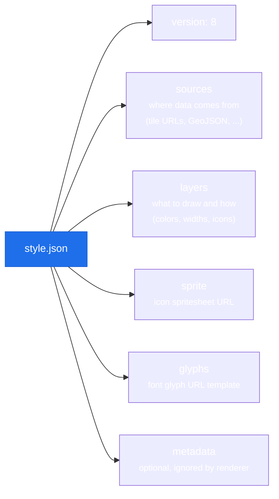

# Map Styles

A MapLibre style is a JSON document that defines everything the map renders: which tile sources to fetch, which layers to draw, and how to style them. Understanding styles lets you switch map themes, load offline tiles, and integrate PMTiles.

## What a style contains



MapLibre fetches tiles, images, and fonts as needed and renders them using the GPU, all described by this one JSON file.

## Built-in styles

The library ships two convenience constants in `MapLibreStyles`:

```dart
import 'package:maplibre_gl/maplibre_gl.dart';

// Free demo tiles from the MapLibre project
MapLibreStyles.demo
// → 'https://demotiles.maplibre.org/style.json'

// OpenFreeMap Liberty style (free, no API key)
MapLibreStyles.openfreemapLiberty
// → 'https://tiles.openfreemap.org/styles/liberty'
```

Use `MapLibreStyles.demo` during development. Switch to `openfreemapLiberty` or your own tile provider for production.

## Specifying a style

Pass a style URL (or asset path) to `MapLibreMap`:

```dart
MapLibreMap(
  styleString: MapLibreStyles.openfreemapLiberty,
  initialCameraPosition: const CameraPosition(
    target: LatLng(48.85, 2.35),
    zoom: 12,
  ),
)
```

### Remote URL

Any `https://` URL pointing to a valid style JSON:

```dart
styleString: 'https://tiles.openfreemap.org/styles/bright'
```

### Local asset

Ship a style JSON in your app bundle. Add it to `pubspec.yaml`:

```yaml
flutter:
  assets:
    - assets/my_style.json
```

Then reference it by asset path:

```dart
styleString: 'assets/my_style.json'
```

This is how PMTiles styles work: the style JSON is local, but it references remote or bundled `.pmtiles` data.

### Raw JSON string

On Android only, you can pass a raw JSON string:

```dart
styleString: '{"version":8,"sources":{},"layers":[]}'
```

Not recommended for production. Use a file.

## Switching style at runtime

```dart
await controller.setStyle(MapLibreStyles.openfreemapLiberty);
```

!!! warning "Style reload clears layers"
    Calling `setStyle()` removes all sources and layers you added programmatically. Re-add them in `onStyleLoadedCallback`.

```dart
MapLibreMap(
  onStyleLoadedCallback: _onStyleLoaded,
)

Future<void> _onStyleLoaded() async {
  // Re-add your GeoJSON sources and layers here
  await controller.addGeoJsonSource(...);
  await controller.addCircleLayer(...);
}
```

## Custom tile headers

If your tile provider requires authentication headers:

```dart
await controller.setCustomHeaders({
  'Authorization': 'Bearer $myToken',
  'X-Api-Key': myApiKey,
});
```

Headers are sent with all tile requests from that point forward.

## Current style info

```dart
final styleJson = await controller.getStyle();
// Returns the full resolved style JSON as a Map<String, dynamic>
```

## PMTiles styles

PMTiles is a self-hosted tile format that bundles all tiles into a single `.pmtiles` file, with no tile server needed. See [PMTiles guide](../advanced/pmtiles.md) for a full walkthrough.

## Popular open tile providers

<div class="table-scroll" markdown>
<table class="comparison-table">
  <thead>
    <tr><th>Provider</th><th>Free tier</th><th>API key</th><th>Style URL</th></tr>
  </thead>
  <tbody>
    <tr><td>OpenFreeMap</td><td><span class="cell-ic"><span class="ic ic--yes">✔</span> Unlimited</span></td><td><span class="cell-ic"><span class="ic ic--no">✘</span> Not needed</span></td><td><code>tiles.openfreemap.org/styles/liberty</code></td></tr>
    <tr><td>MapLibre demo</td><td><span class="cell-ic"><span class="ic ic--mid">●</span> Dev only</span></td><td><span class="cell-ic"><span class="ic ic--no">✘</span> Not needed</span></td><td><code>demotiles.maplibre.org/style.json</code></td></tr>
    <tr><td>Maptiler</td><td><span class="cell-ic"><span class="ic ic--mid">●</span> Limited</span></td><td><span class="cell-ic"><span class="ic ic--yes">✔</span> Required</span></td><td><code>api.maptiler.com/maps/basic/style.json?key=...</code></td></tr>
    <tr><td>Stadia Maps</td><td><span class="cell-ic"><span class="ic ic--mid">●</span> Limited</span></td><td><span class="cell-ic"><span class="ic ic--yes">✔</span> Required</span></td><td><code>tiles.stadiamaps.com/styles/alidade_smooth.json?api_key=...</code></td></tr>
    <tr><td>AWS Location</td><td><span class="cell-ic"><span class="ic ic--no">✘</span> Pay-as-you-go</span></td><td><span class="cell-ic"><span class="ic ic--yes">✔</span> Required</span></td><td>Via AWS SDK</td></tr>
  </tbody>
</table>
</div>
