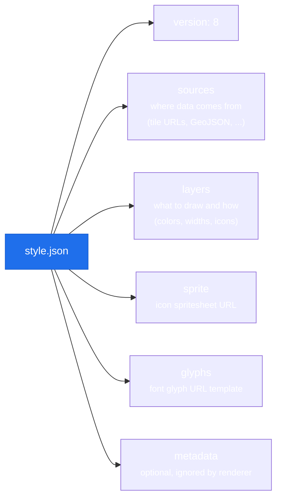

# Map Styles

A MapLibre style is a JSON document that defines everything the map renders: which tile sources to fetch, which layers to draw, and how to style them. Understanding styles lets you switch map themes, load offline tiles, and integrate PMTiles.

## What a style contains


```mermaid
flowchart LR
    S["style.json"]
    S --> V["version: 8"]
    S --> SRC["sources<br/><small>where data comes from<br/>(tile URLs, GeoJSON, ...)</small>"]
    S --> L["layers<br/><small>what to draw and how<br/>(colors, widths, icons)</small>"]
    S --> SP["sprite<br/><small>icon spritesheet URL</small>"]
    S --> GL["glyphs<br/><small>font glyph URL template</small>"]
    S --> M["metadata<br/><small>optional, ignored by renderer</small>"]

    classDef root fill:#1f6feb,stroke:#1a5fd0,color:#fff;
    class S root
```

MapLibre fetches tiles, images, and fonts as needed and renders them using the GPU, all described by this one JSON file.

## Built-in styles

The library ships two convenience constants in `MapLibreStyles`:

```dart
import 'package:maplibre_gl/maplibre_gl.dart';

// Free demo tiles from the MapLibre project
MapLibreStyles.demo
// → 'https://demotiles.maplibre.org/style.json'

// OpenFreeMap Liberty style (free, no API key)
MapLibreStyles.openfreemapLiberty
// → 'https://tiles.openfreemap.org/styles/liberty'
```

Use `MapLibreStyles.demo` during development. Switch to `openfreemapLiberty` or your own tile provider for production.

## Specifying a style

Pass a style URL (or asset path) to `MapLibreMap`:

```dart
MapLibreMap(
  styleString: MapLibreStyles.openfreemapLiberty,
  initialCameraPosition: const CameraPosition(
    target: LatLng(48.85, 2.35),
    zoom: 12,
  ),
)
```

### Remote URL

Any `https://` URL pointing to a valid style JSON:

```dart
styleString: 'https://tiles.openfreemap.org/styles/bright'
```

### Local asset

Ship a style JSON in your app bundle. Add it to `pubspec.yaml`:

```yaml
flutter:
  assets:
    - assets/my_style.json
```

Then reference it by asset path:

```dart
styleString: 'assets/my_style.json'
```

This is how PMTiles styles work: the style JSON is local, but it references remote or bundled `.pmtiles` data.

### File on device

An absolute path to a JSON file the app wrote itself, for example a style downloaded into
the documents directory:

```dart
styleString: '/data/user/0/com.example.app/app_flutter/my_style.json'
```

### Raw JSON string

On Android only, you can pass a raw JSON string:

```dart
styleString: '{"version":8,"sources":{},"layers":[]}'
```

Not recommended for production. Use a file.

## Switching style at runtime

```dart
await controller.setStyle(MapLibreStyles.openfreemapLiberty);
```

!!! warning "Style reload clears layers"
    Calling `setStyle()` removes all sources and layers you added programmatically. Re-add them in `onStyleLoadedCallback`.

```dart
MapLibreMap(
  onStyleLoadedCallback: _onStyleLoaded,
)

Future<void> _onStyleLoaded() async {
  // Re-add your GeoJSON sources and layers here
  await controller.addGeoJsonSource(...);
  await controller.addCircleLayer(...);
}
```

## Custom tile headers

If your tile provider requires authentication headers:

```dart
await controller.setCustomHeaders(
  {
    'Authorization': 'Bearer $myToken',
    'X-Api-Key': myApiKey,
  },
  [], // no URL filter: apply to every request
);
```

Headers are sent with all tile requests from that point forward. The second argument is a list of regular expressions: pass patterns there to restrict the headers to matching URLs. Android and iOS only: the call throws `UnimplementedError` on web. For headers that apply to every map in the process, use the top-level `setHttpHeaders` function.

## Current style info

```dart
final styleJson = await controller.getStyle();
// The full resolved style as a JSON string, or null if the style is not ready.
// Decode it with jsonDecode when you need a map.
```

To inspect one piece of the style instead of all of it, read a single layer or source by id. Both return the object's properties as a style-spec map, in the same shape on every platform, or `null` when the id does not exist:

```dart
final ids = await controller.getLayerIds();              // what is in the style
final layer = await controller.getLayerProperties('roads');
final source = await controller.getSourceProperties('osm');

if (layer != null) {
  debugPrint('roads is a ${layer['type']} layer');
}
```

This is useful for reading a value the active style chose before overriding it, and for asserting in tests that your runtime styling landed. `null` is the answer for an unknown id rather than an error, so it doubles as an existence check.

## Attribution

Styles carry attribution for their data, and the map shows it in an (i) button whose position and margins you can set with `attributionButtonPosition` and `attributionButtonMargins`. When the SDK's own tint does not read well against a particular style, for example a dark basemap, override just the color:

```dart
MapLibreMap(
  attributionButtonColor: Colors.white,
)
```

Leave it unset to keep the MapLibre default. Android and iOS only: on web that control is HTML and is styled with CSS.

Move it and recolor it, but keep it visible. Nearly every open basemap is built from OpenStreetMap data, published under the ODbL, which requires crediting `© OpenStreetMap contributors` with a link to [openstreetmap.org/copyright](https://www.openstreetmap.org/copyright); tile providers add their own terms on top. When you add a source yourself with `addSource`, set its `attribution` property so the control has something to show.

## PMTiles styles

PMTiles is a self-hosted tile format that bundles all tiles into a single `.pmtiles` file, with no tile server needed. See [PMTiles guide](../advanced/pmtiles.md) for a full walkthrough.

## Popular open tile providers

Terms change; this summary is accurate as of August 2026, so check each provider's page before you commit to one. All of them require you to keep their attribution visible.

<div class="table-scroll" markdown>
<table class="comparison-table">
  <thead>
    <tr><th>Provider</th><th>Free tier</th><th>API key</th><th>Style URL</th></tr>
  </thead>
  <tbody>
    <tr><td><a href="https://openfreemap.org/">OpenFreeMap</a></td><td><span class="cell-ic"><span class="ic ic--yes">✔</span> No published cap</span></td><td><span class="cell-ic"><span class="ic ic--no">✘</span> Not needed</span></td><td><code>tiles.openfreemap.org/styles/liberty</code></td></tr>
    <tr><td>MapLibre demo</td><td><span class="cell-ic"><span class="ic ic--mid">●</span> Dev only</span></td><td><span class="cell-ic"><span class="ic ic--no">✘</span> Not needed</span></td><td><code>demotiles.maplibre.org/style.json</code></td></tr>
    <tr><td><a href="https://www.maptiler.com/cloud/pricing/">MapTiler</a></td><td><span class="cell-ic"><span class="ic ic--mid">●</span> Free tier</span></td><td><span class="cell-ic"><span class="ic ic--yes">✔</span> Required</span></td><td><code>api.maptiler.com/maps/basic/style.json?key=...</code></td></tr>
    <tr><td><a href="https://stadiamaps.com/pricing/">Stadia Maps</a></td><td><span class="cell-ic"><span class="ic ic--mid">●</span> Free tier</span></td><td><span class="cell-ic"><span class="ic ic--yes">✔</span> Required</span></td><td><code>tiles.stadiamaps.com/styles/alidade_smooth.json?api_key=...</code></td></tr>
    <tr><td><a href="https://aws.amazon.com/location/pricing/">AWS Location</a></td><td><span class="cell-ic"><span class="ic ic--mid">●</span> Pay-as-you-go</span></td><td><span class="cell-ic"><span class="ic ic--yes">✔</span> Required</span></td><td>Via AWS SDK</td></tr>
  </tbody>
</table>
</div>
