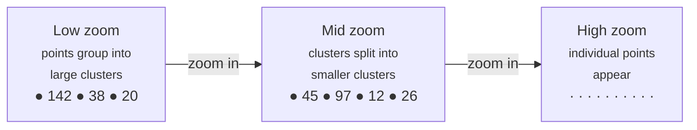

# Cluster

Clustering groups nearby points into a single bubble at low zoom levels. As users zoom in, clusters expand to reveal individual features. MapLibre handles clustering natively, with no JavaScript or server-side code needed.

<iframe
  class="example-iframe"
  src="/flutter-maplibre-gl/?example=doc-cluster"
  title="Cluster"
  loading="lazy"
></iframe>

200 random points around Paris. Clusters show a count and collapse/expand as you zoom.

## How clustering works



Clustering is a source-level feature, you enable it on `GeojsonSourceProperties`, then add separate layers for clusters and individual points.

## Full setup

```dart
// 1. Add source with clustering enabled, passing the data inline.
await controller.addSource(
  'events',
  GeojsonSourceProperties(
    data: featureCollection,   // inline GeoJSON map, or a URL string
    cluster: true,
    clusterMaxZoom: 14,   // stop clustering above this zoom
    clusterRadius: 50,    // pixel radius to group into one cluster
  ),
);

// 2. Cluster circles: sized by point count
await controller.addCircleLayer(
  'events', 'cluster-circles',
  CircleLayerProperties(
    circleRadius: [
      Expressions.step,
      [Expressions.get, 'point_count'],
      18,        // base size
      10,  24,   // >= 10 points
      50,  32,   // >= 50 points
      100, 42,   // >= 100 points
    ],
    circleColor: [
      Expressions.step,
      [Expressions.get, 'point_count'],
      '#51bbd6',
      10,  '#f1f075',
      50,  '#f28cb1',
      100, '#E74C3C',
    ],
    circleOpacity: 0.85,
    circleStrokeWidth: 2,
    circleStrokeColor: '#ffffff',
  ),
  filter: ['has', 'point_count'],  // only cluster features
);

// 3. Cluster count label
await controller.addSymbolLayer(
  'events', 'cluster-count',
  SymbolLayerProperties(
    textField: [Expressions.get, 'point_count_abbreviated'],
    textSize: 13,
    textColor: '#1a1a2e',
    textAllowOverlap: true,
  ),
  filter: ['has', 'point_count'],
);

// 4. Individual (unclustered) points
await controller.addCircleLayer(
  'events', 'unclustered-point',
  const CircleLayerProperties(
    circleRadius: 5,
    circleColor: '#296CA8',
    circleStrokeWidth: 1.5,
    circleStrokeColor: '#ffffff',
  ),
  filter: ['!', ['has', 'point_count']],  // only non-cluster features
);
```

## Cluster properties on GeoJSON source

| Property | Default | Description |
|---|---|---|
| `cluster` | false | Enable clustering |
| `clusterMaxZoom` | 14 | Zoom at which clustering stops |
| `clusterRadius` | 50 | Pixel radius to group points |

## Cluster feature properties

When clustering is enabled, cluster features have extra properties:

| Property | Description |
|---|---|
| `point_count` | Number of points in the cluster |
| `point_count_abbreviated` | Abbreviated count: "142", "1.2k" |
| `cluster_id` | Internal cluster ID |
| `cluster` | Always `true` for cluster features |

## Filters for cluster vs. point layers

```dart
// Show only cluster bubbles
filter: ['has', 'point_count']

// Show only individual points
filter: ['!', ['has', 'point_count']]
```

Always add these filters. Without them, both layers apply to all features.

## Update cluster data

```dart
// Refresh cluster data (e.g., after fetching from API)
await controller.setGeoJsonSource('events', newFeatureCollection);
// Clusters recalculate automatically
```

## Key APIs

- [`MapLibreMapController.addSource()`](https://pub.dev/documentation/maplibre_gl/latest/maplibre_gl/MapLibreMapController/addSource.html)
- [`GeojsonSourceProperties`](https://pub.dev/documentation/maplibre_gl/latest/maplibre_gl/GeojsonSourceProperties-class.html)
- [`Expressions.step`](https://pub.dev/documentation/maplibre_gl/latest/maplibre_gl/Expressions/step-constant.html)
